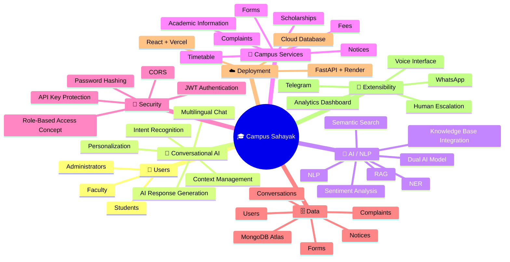
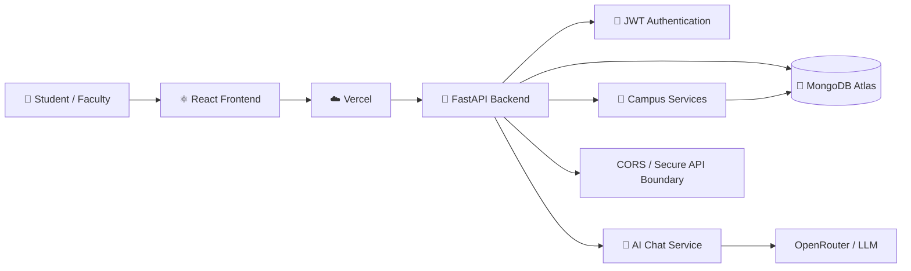
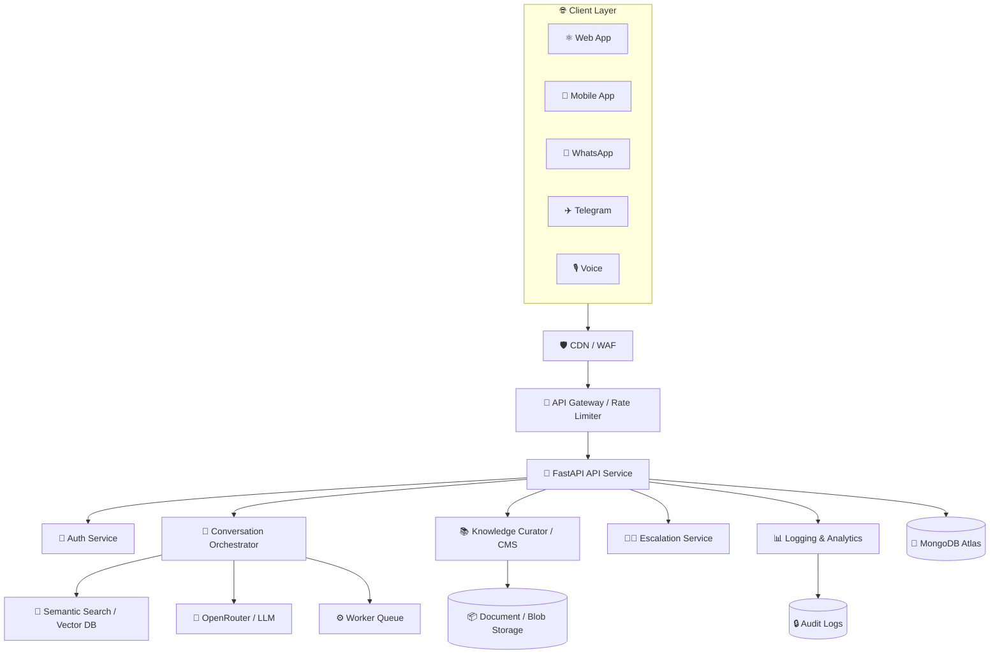
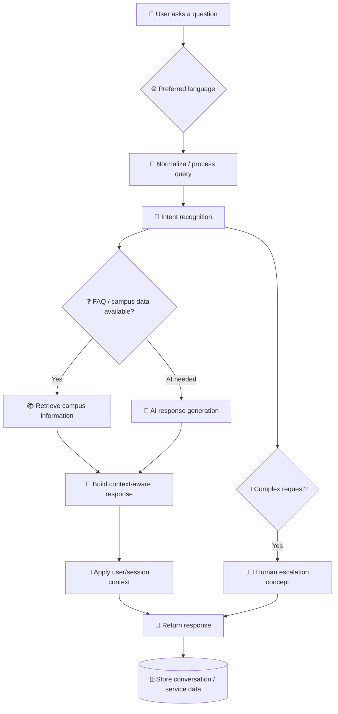
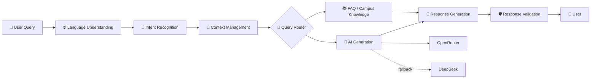
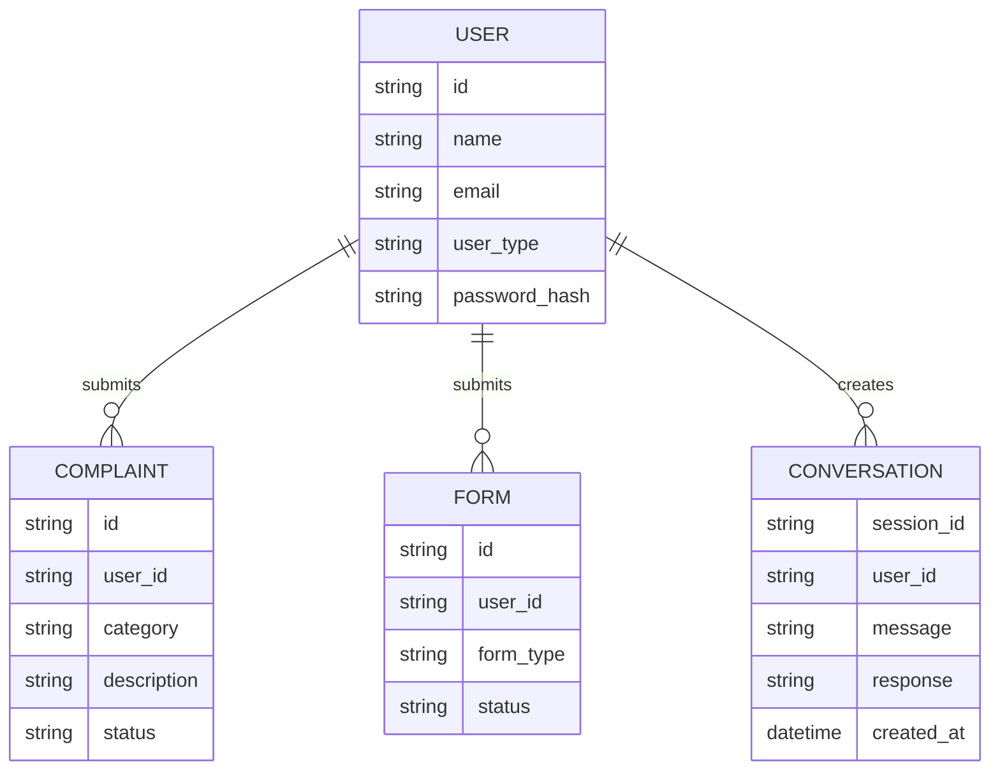
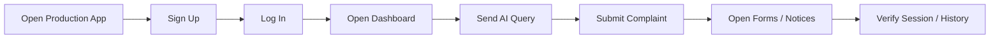
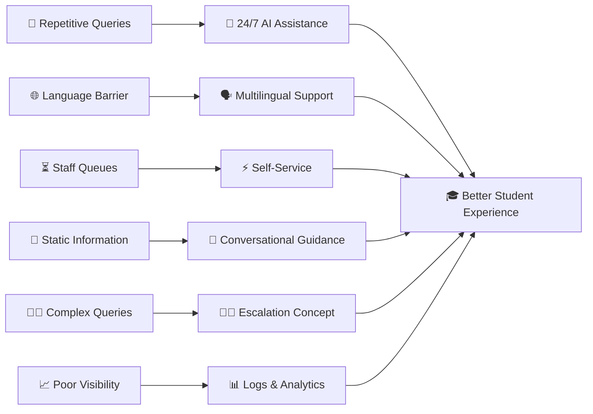
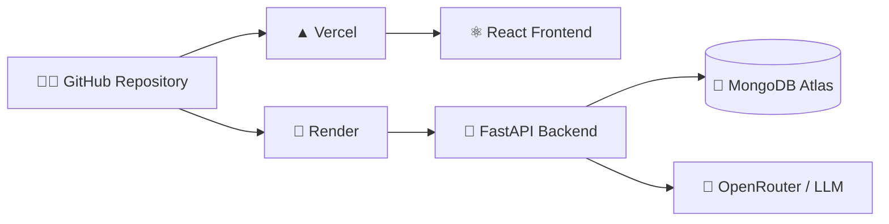
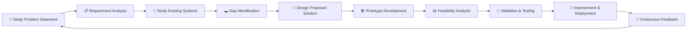

<div align="center">

# 🎓 Campus Sahayak

### AI-Powered Multilingual Campus Assistant


<br />

<a href="https://campus-management-system-frontend.vercel.app">
  
</a>
<a href="https://github.com/Avinraj01/Campus-Sahayak">
  
</a>

<br /><br />


<br /><br />

**Campus Sahayak is a multilingual, AI-powered campus assistance platform that combines conversational AI, secure authentication, student services, and campus information into one digital experience.**

</div>

---

## 🌐 Product Snapshot

> **Ask. Understand. Act.**
>
> Campus Sahayak is designed to move beyond a basic FAQ chatbot. The platform aims to let students ask questions in their preferred language, receive context-aware answers, and access campus services such as complaints, forms, notices, and academic information from a unified interface.

### 🎯 The Problem

Students repeatedly ask institutions the same questions about:

- 💰 Fees and scholarships
- 🗓️ Timetables, academic calendars and deadlines
- 📝 Forms and campus procedures
- 📢 Notices and announcements
- 🏫 Student services
- 🧑‍💼 Administrative processes

At the same time, staff spend valuable time answering repetitive Level-1 queries manually.

### 💡 The Solution

Campus Sahayak introduces a **24/7 conversational campus assistant** that is designed around:

| Challenge | Campus Sahayak Approach |
|---|---|
| Repetitive student queries | 🤖 Automated conversational support |
| Language barriers | 🌐 6+ language support |
| Static information | 🧠 Context-aware interaction |
| Manual service navigation | ⚡ Forms, complaints and notices in one platform |
| Complex queries | 👩‍💻 Human escalation concept |
| Changing campus information | 🛠️ Content-management / admin workflow |

The Smart India Hackathon proposal describes support for **English, Hindi, Gujarati, Rajasthani, Telugu and Urdu**, alongside a modular architecture intended to be adaptable across institutions. fileciteturn122file2

---

# 🚀 Live Experience

<div align="center">

### 🌐 Try the Prototype

<a href="https://campus-management-system-frontend.vercel.app">
  
</a>

### 🎥 User Experience Demo

**YouTube video:** `Add your final YouTube URL here`

> The supplied SIH material references a **User Experience** video/link, but the actual YouTube URL is not present in the extracted source. It is intentionally left as a placeholder rather than inventing a link. fileciteturn122file1

</div>

---

# 🧭 High-Level Mind Map



The AI/NLP capabilities, campus-service scope and multilingual workflow are derived from the SIH proposal material. fileciteturn122file2

---

# 🏗️ System Architecture

### Current implemented deployment path



### 🧩 Expanded target architecture

The SIH proposal also describes a broader architecture containing an API gateway/rate limiter, conversation orchestrator, knowledge curator, escalation service, semantic search/vector DB, worker queue, audit logs and multiple client channels. Those components are presented here as the **proposed/extensible architecture**, not as claims that every component is currently deployed in this repository. fileciteturn122file8



---

# 🔄 End-to-End Workflow



The SIH workflow specifically describes regional-language queries, intent recognition, FAQ matching versus AI handling, MongoDB storage, response generation, content management and logging. fileciteturn122file2

---

# 🧠 AI Architecture



The hackathon proposal describes a **dual-AI setup using OpenRouter with DeepSeek fallback** as a reliability strategy. fileciteturn122file2

---

# 🛠️ Technology Stack

<div align="center">

| Layer | Technology | Role |
|---|---|---|
| 🎨 Frontend | **React** | Responsive web application |
| 🎨 Styling | **Tailwind CSS / CSS** | Modern UI and responsive styling |
| 🔗 HTTP Client | **Axios** | Frontend API communication |
| 🐍 Backend | **FastAPI / Python** | Asynchronous REST API |
| 🗄️ Database | **MongoDB Atlas** | Users, services and conversation data |
| 🔐 Authentication | **JWT** | Stateless authentication |
| 🤖 AI | **OpenRouter / LLM** | Conversational AI responses |
| 🧠 AI Fallback | **DeepSeek** | Proposed fallback model |
| ☁️ Frontend Deploy | **Vercel** | Production frontend hosting |
| ☁️ Backend Deploy | **Render** | Production API hosting |
| 🧰 Version Control | **Git + GitHub** | Source control and collaboration |

</div>

The core technical stack in the SIH technical-approach material is React, Tailwind CSS, FastAPI, MongoDB Atlas, OpenRouter/DeepSeek, JWT, Vercel and Render. fileciteturn122file8

---

# ✨ Key Features

### 🌐 Multilingual Assistance

Designed to support **6+ languages**, including English, Hindi, Gujarati, Rajasthani, Telugu and Urdu. fileciteturn122file2

### 🤖 AI-Powered Chat

Conversational assistance for campus-related questions, with an architecture designed for context-aware responses.

### 🔐 Secure Authentication

JWT-based authentication, password hashing, CORS protection and API-key separation are part of the security approach.

### 📝 Student Services

The platform exposes service areas for:

- Complaints
- Forms
- Notices
- Chat
- Authentication

### 🧠 Context-Aware Interaction

The proposed experience goes beyond anonymous FAQ retrieval by using conversational context and user-specific information where appropriate. fileciteturn122file2

### 🛠️ Modular Design

The system is structured so campus services can evolve independently rather than turning the chatbot into one giant hard-coded feature.

---

# 🧩 Core API Surface

| Method | Endpoint | Purpose |
|---|---|---|
| `POST` | `/api/auth/register` | Register a user |
| `POST` | `/api/auth/login` | Authenticate a user |
| `POST` | `/api/chat` | Send a chat query |
| `GET` | `/api/chat/history/{session_id}` | Retrieve chat history |
| `POST` | `/api/complaints` | Submit a complaint |
| `GET` | `/api/complaints` | Retrieve complaints |
| `POST` | `/api/forms` | Submit a form |
| `GET` | `/api/forms` | Retrieve forms |
| `GET` | `/api/notices` | Retrieve campus notices |

The deployed backend also exposes API documentation through FastAPI's `/docs` endpoint.

---

# 🗃️ Data Model Overview



> The diagram is a conceptual representation of the service/data relationships. It is not intended to document every MongoDB field.

---

# 🧪 Testing & Validation

A good README should show **how the system is tested**, not merely say “tested”. The following test matrix covers the core application paths.

| ID | Area | Test Case | Expected Result |
|---|---|---|---|
| TC-01 | Registration | Register with valid student data | User is created successfully |
| TC-02 | Registration | Register with an existing identifier | Duplicate registration is rejected |
| TC-03 | Login | Login with valid credentials | JWT/session is returned and user enters portal |
| TC-04 | Login | Login with invalid password | Authentication fails safely |
| TC-05 | Authorization | Call protected endpoint without token | Request is rejected |
| TC-06 | Chat | Send a normal campus query | AI/campus response is returned |
| TC-07 | Chat | Send a multilingual query | Response follows supported language/context |
| TC-08 | Chat History | Open an existing session | Previous conversation is returned |
| TC-09 | Complaints | Submit valid complaint | Complaint is stored with initial status |
| TC-10 | Complaints | Retrieve user's complaints | Only relevant complaint records are returned |
| TC-11 | Forms | Submit a valid form | Form submission is stored |
| TC-12 | Notices | Request notices | Available notices are returned |
| TC-13 | CORS | Request API from an allowed frontend origin | Browser request succeeds |
| TC-14 | CORS | Request API from an unapproved origin | Browser blocks the request |
| TC-15 | AI Failure | AI provider is unavailable | Application returns a controlled error/fallback path |
| TC-16 | Database | MongoDB temporarily unavailable | API fails gracefully rather than silently corrupting data |
| TC-17 | Deployment | Open production frontend | Application loads successfully |
| TC-18 | Deployment | Frontend calls production API | API request reaches the backend |

### 🔍 Manual Smoke-Test Flow



> These are **test cases and expected outcomes**, not a claim that every case has been automatically executed. Automated CI tests can be added later under `tests/`.

---

# 📊 Problem → Solution → Impact



The SIH proposal highlights equitable multilingual access, 24/7 support, reduced repetitive workload, data-driven insights and a more self-service-oriented student experience. fileciteturn122file1

---

# 🎓 User Experience

### Student Journey

```text
┌───────────────────────┐
│ 👤 Student opens app  │
└───────────┬───────────┘
            ↓
┌───────────────────────┐
│ 🔐 Login / Sign Up    │
└───────────┬───────────┘
            ↓
┌───────────────────────┐
│ 🏠 Campus Dashboard   │
└───────────┬───────────┘
            ↓
     ┌──────┴───────┐
     ↓              ↓
┌───────────┐  ┌──────────────┐
│ 🤖 Ask AI │  │ 📝 Services  │
└─────┬─────┘  └──────┬───────┘
      ↓               ↓
┌───────────┐   ┌──────────────┐
│ 💬 Answer │   │ Forms /      │
│ + Context │   │ Complaints / │
└─────┬─────┘   │ Notices      │
      │         └──────┬───────┘
      └────────┬───────┘
               ↓
       ┌───────────────┐
       │ 🎯 Resolution │
       └───────────────┘
```

The SIH material frames the product as more than a chatbot: students can access forms and complaint status inside the conversational experience, while staff can focus on complex tasks. fileciteturn122file2

---

# 📈 Expected Impact

### 🎓 For Students

- 🌐 More equitable access through multilingual support
- ⏰ Always-on assistance
- ⚡ Faster access to campus information
- 🧭 Less dependency on manual navigation
- 📚 Better access to academic and administrative information

### 🏢 For Administrative Staff

- 🔁 Reduction in repetitive Level-1 queries
- ⏱️ More time for complex tasks
- 📊 Better visibility into recurring student problems
- 🧠 Potential for proactive service improvements

### 🌱 Broader Benefits

The proposal also identifies social, economic, environmental and educational benefits such as inclusivity, digital literacy, cost savings, paperless processes and improved learning support. fileciteturn122file1

> **Important:** Figures such as “up to 70%” workload reduction are proposal targets/claims from the SIH material, not measured production benchmarks for this repository. fileciteturn122file1

---

# ⚖️ Feasibility & Design Considerations

| Dimension | Consideration |
|---|---|
| 🛠️ Technical | React + FastAPI + MongoDB + AI APIs provide a practical foundation |
| 💰 Economic | Vercel, Render and MongoDB Atlas free/affordable tiers can keep prototype costs low |
| 👥 Operational | Modular services can make campus-specific updates easier |
| 🧠 AI Accuracy | Regional-language quality and hallucination risk require testing and verified knowledge sources |
| 🔐 Privacy | Student information requires strong authentication, access controls and secure storage |
| 📈 Scalability | Admission/exam periods may create significantly higher request volumes |
| 🎯 Adoption | The assistant must remain useful and engaging enough for students to actually use it |

The feasibility material explicitly identifies AI accuracy, privacy/security, peak-load scalability and user adoption as important risks. fileciteturn122file4

---

# 🔐 Security

Current security-oriented practices include:

- 🔑 JWT-based authentication
- 🔒 Password hashing
- 🌐 CORS controls
- 🔐 Environment-based API secrets
- 🚫 No API keys committed to source code
- 🧱 Protected backend endpoints

### Recommended production hardening

```text
RBAC
 ↓
Rate Limiting
 ↓
Input Validation
 ↓
Audit Logging
 ↓
Secret Rotation
 ↓
Monitoring & Alerting
```

The SIH architecture also proposes OAuth 2.0, immutable audit logs, RBAC, encrypted data and anonymized analytics as future/extended security measures. fileciteturn122file4

---

# 📂 Repository Structure

```text
Campus-Sahayak/
│
├── 📁 backend/
│   ├── server.py
│   ├── requirements.txt
│   ├── render.yaml
│   └── .env.example
│
├── 📁 frontend/
│   ├── src/
│   ├── public/
│   ├── package.json
│   ├── vercel.json
│   └── .env.example
│
├── 📁 docs/
│
├── 📄 .gitignore
└── 📄 README.md
```

---

# ⚙️ Local Development

## 1. Clone

```bash
git clone https://github.com/Avinraj01/Campus-Sahayak.git
cd Campus-Sahayak
```

## 2. Backend

```bash
cd backend
python -m venv venv
```

### macOS / Linux

```bash
source venv/bin/activate
```

### Windows

```powershell
venv\Scripts\activate
```

Install dependencies:

```bash
pip install -r requirements.txt
```

Create environment variables from the example file and configure MongoDB, JWT and AI provider credentials.

```bash
cp .env.example .env
```

Start the backend:

```bash
python server.py
```

Backend:

```text
http://localhost:8000
```

API docs:

```text
http://localhost:8000/docs
```

## 3. Frontend

```bash
cd frontend
npm install --legacy-peer-deps
cp .env.example .env
npx craco start
```

Frontend:

```text
http://localhost:3000
```

---

# 🔑 Environment Variables

### Backend

```env
MONGO_URL=your-mongodb-uri
DB_NAME=campusDB
JWT_SECRET=your-jwt-secret
OPENROUTER_API_KEY=your-openrouter-api-key
CORS_ORIGINS=http://localhost:3000
```

### Frontend

```env
REACT_APP_BACKEND_URL=http://localhost:8000/api
```

> Never commit real API keys, MongoDB credentials or JWT secrets. Use deployment environment variables instead.

---

# ☁️ Deployment



### Production Components

| Component | Platform |
|---|---|
| Frontend | Vercel |
| Backend | Render |
| Database | MongoDB Atlas |
| AI | OpenRouter / configured LLM provider |
| Source | GitHub |

---

# 🧪 Suggested Automated Test Structure

For the next engineering iteration, tests can be organized as:

```text
tests/
├── unit/
│   ├── test_auth.py
│   ├── test_chat.py
│   └── test_services.py
│
├── integration/
│   ├── test_auth_api.py
│   ├── test_chat_api.py
│   └── test_database.py
│
└── e2e/
    ├── login.spec.js
    ├── signup.spec.js
    └── chatbot.spec.js
```

Recommended tooling:

```text
pytest          → Backend unit/integration tests
httpx           → FastAPI API testing
Playwright      → Browser/E2E testing
GitHub Actions  → CI automation
```

---

# 🔬 Research & Design Workflow

The SIH proposal follows a research workflow from problem study through continuous improvement:



This workflow is represented in the SIH research material and connects requirement analysis, existing-system comparison, prototype development, validation and continuous improvement. fileciteturn122file3

---

# 🆚 Campus Sahayak vs Traditional Support

| Capability | Traditional Help Desk | Basic FAQ Bot | Campus Sahayak |
|---|:---:|:---:|:---:|
| 24/7 availability | ❌ | ✅ | ✅ |
| Multilingual support | ⚠️ | ⚠️ | ✅ |
| Conversational context | ❌ | ⚠️ | ✅ |
| Personalized guidance | ⚠️ | ❌ | ✅ |
| Action-oriented services | ⚠️ | ❌ | ✅ |
| Human escalation concept | ✅ | ⚠️ | ✅ |
| Modular campus platform | ⚠️ | ❌ | ✅ |

The comparison is based on the capability comparison presented in the SIH research material. fileciteturn122file3

---

# 🔮 Roadmap

```text
                         CAMPUS SAHAYAK ROADMAP
                                  │
       ┌──────────────────────────┼──────────────────────────┐
       │                          │                          │
       ▼                          ▼                          ▼
   🧠 AI                       🏫 SERVICES                 🌐 CHANNELS
       │                          │                          │
       ├─ RAG                     ├─ Forms                   ├─ Web
       ├─ Better multilingual    ├─ Complaints              ├─ WhatsApp
       ├─ Intent routing         ├─ Notices                 ├─ Telegram
       ├─ Evaluation             └─ CMS                     └─ Voice
       │
       ▼
   🔐 PLATFORM
       │
       ├─ RBAC
       ├─ Rate limiting
       ├─ Audit logs
       ├─ Analytics
       └─ CI/CD testing
```

The WhatsApp, Telegram, voice, RAG, vector search, human escalation and analytics capabilities are part of the broader SIH proposal/roadmap; they should not be interpreted as all being production-enabled in the current repository. fileciteturn122file1turn122file8

---

# 🏆 Smart India Hackathon Context

**Problem Statement:** Language Agnostic Chatbot  
**Problem Statement ID:** 25104  
**Theme:** Smart Education  
**Category:** Software  
**Team:** SuperNovaZ  
**Team ID:** 105985  
**Project:** Campus Sahayak

The supplied SIH presentation identifies Campus Sahayak as an AI-powered multilingual chatbot for smart education and describes the proposed solution, workflow, architecture, feasibility, impact and research process. fileciteturn122file0

---

# 👨‍💻 Author

<div align="center">

**Avin Raj**  
Computer Science & Engineering

Built as part of the **SuperNovaZ** Smart India Hackathon 2025 project.

</div>

---

# ⭐ Support the Project

If Campus Sahayak is useful or interesting, consider:

- ⭐ Starring the repository
- 🐛 Reporting reproducible issues
- 💡 Suggesting improvements
- 🔧 Contributing features
- 📢 Sharing the project

---

<div align="center">

### 🎓 Campus Sahayak

**Ask less. Find faster. Get things done.**

<br />


<br /><br />


</div>
