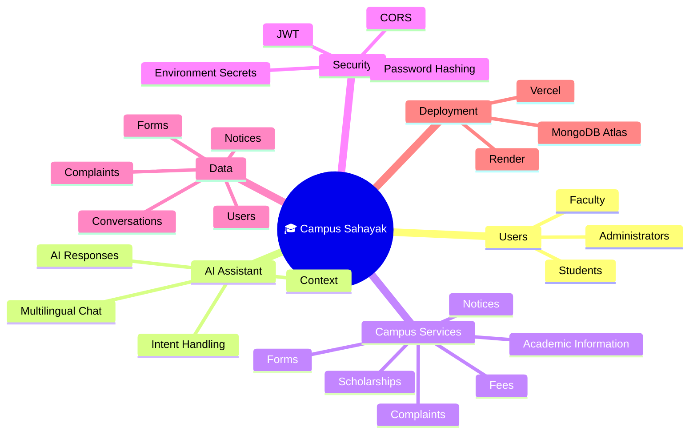
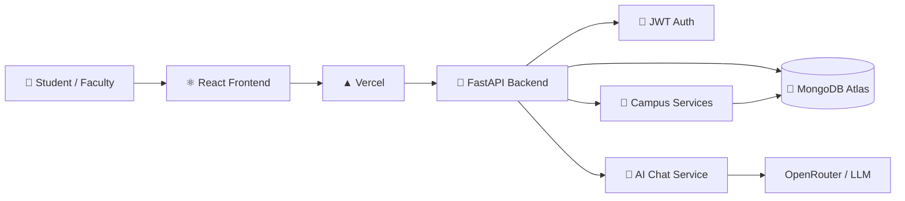
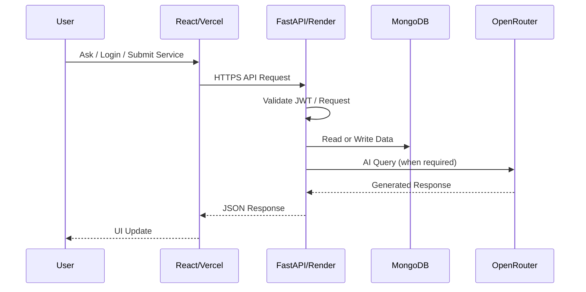
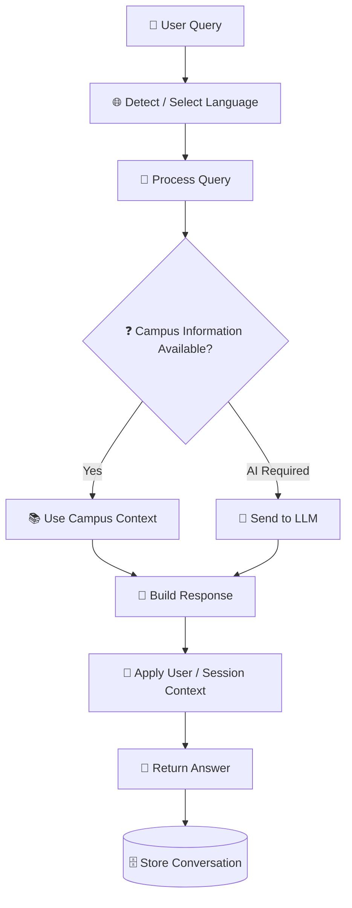
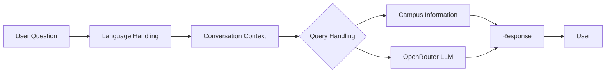
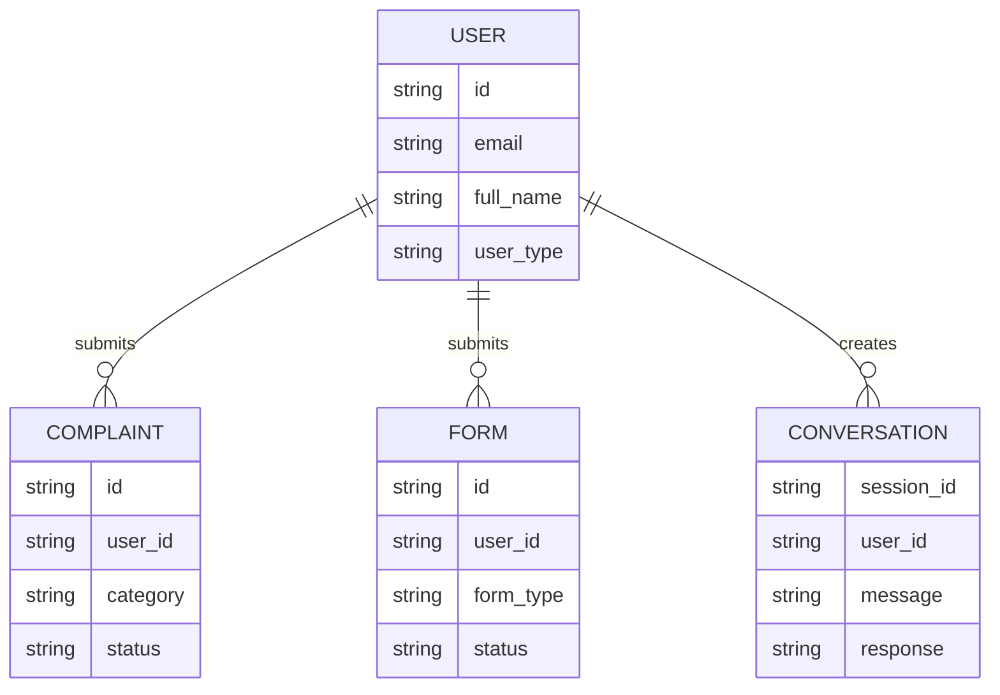
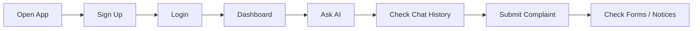
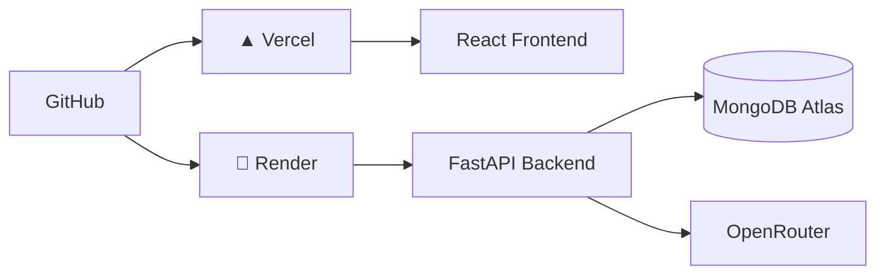

<div align="center">

# 🎓 Campus Sahayak

### AI-Powered Multilingual Campus Assistant


<br />

<a href="https://campus-management-system-frontend.vercel.app"></a>
<a href="https://github.com/Avinraj01/Campus-Sahayak"></a>

<br /><br />


<br /><br />

**Campus Sahayak** is a multilingual, AI-powered campus assistance platform that brings conversational AI, authentication, student services, notices, forms and complaints into one digital experience.

</div>

---

## 🌐 What Problem Does It Solve?

Students repeatedly need answers about fees, scholarships, timetables, notices, forms, complaints and administrative procedures. Traditional support depends heavily on office hours and repetitive staff responses.

**Campus Sahayak turns these repetitive interactions into a 24/7 conversational self-service experience.**

| Challenge | Solution |
|---|---|
| 🔁 Repetitive questions | 🤖 AI-powered assistance |
| 🌐 Language barriers | 🗣️ Multilingual interaction |
| 📄 Scattered services | 🏫 Unified campus portal |
| ⏳ Office-hour dependency | ⚡ 24/7 digital access |
| 🧭 Difficult navigation | 💬 Conversational guidance |

---

# ✨ Core Features

- 🤖 **AI Campus Assistant** for campus-related questions
- 🌐 **Multilingual support**: English, Hindi, Gujarati, Telugu, Rajasthani and Urdu
- 🔐 **JWT authentication** with password hashing
- 👨‍🎓 **Student portal** and authenticated services
- 📝 **Complaint management**
- 📄 **Form submission**
- 📢 **Campus notices**
- 💬 **Chat history / sessions**
- ☁️ **Vercel + Render deployment**
- 🍃 **MongoDB Atlas persistence**

---

# 🧭 High-Level Mind Map



---

# 🏗️ System Architecture

### Production architecture



### Request flow



---

# 🔄 End-to-End AI Workflow



---

# 🧠 AI Layer



> The current deployed chatbot uses the configured OpenRouter model. Any additional RAG, vector search, voice, WhatsApp or Telegram components should be treated as future extensions unless implemented in the repository.

---

# 🛠️ Technology Stack

| Layer | Technology | Purpose |
|---|---|---|
| Frontend | React 18 | User interface |
| Styling | CSS / Tailwind where used | Responsive UI |
| HTTP | Axios | API communication |
| Backend | Python + FastAPI | REST API |
| Authentication | JWT + bcrypt/passlib | Secure sessions and passwords |
| Database | MongoDB Atlas | Persistent application data |
| AI | OpenRouter / configured LLM | Conversational responses |
| Deployment | Vercel | Frontend hosting |
| Deployment | Render | Backend hosting |
| Version Control | Git + GitHub | Source control |

---

# 🧩 API Surface

| Method | Endpoint | Purpose |
|---|---|---|
| `POST` | `/api/auth/register` | Register user |
| `POST` | `/api/auth/login` | Authenticate user |
| `POST` | `/api/chat` | Send AI query |
| `GET` | `/api/chat/history/{session_id}` | Get chat history |
| `POST` | `/api/complaints` | Create complaint |
| `GET` | `/api/complaints` | Get user complaints |
| `POST` | `/api/forms` | Submit form |
| `GET` | `/api/forms` | Get submitted forms |
| `GET` | `/api/notices` | Get active notices |

API documentation is available through FastAPI's `/docs` endpoint on the deployed backend.

---

# 🗃️ Data Model



> Conceptual model only. It does not claim to document every MongoDB field.

---

# 🧪 Test Cases

| ID | Test | Expected Result |
|---|---|---|
| TC-01 | Register with valid details | User is created |
| TC-02 | Register duplicate account | Registration is rejected |
| TC-03 | Login with valid credentials | JWT returned and portal opens |
| TC-04 | Login with wrong password | Authentication rejected |
| TC-05 | Protected API without token | Request rejected |
| TC-06 | Ask normal chatbot question | AI response returned |
| TC-07 | Ask in supported language | Response follows language context |
| TC-08 | Retrieve chat history | Session history returned |
| TC-09 | Submit complaint | Complaint stored |
| TC-10 | Retrieve complaints | User complaints returned |
| TC-11 | Submit form | Form stored successfully |
| TC-12 | Retrieve notices | Active notices returned |
| TC-13 | Allowed CORS origin | Browser request succeeds |
| TC-14 | Invalid CORS origin | Browser blocks request |
| TC-15 | AI provider failure | Controlled fallback/error returned |
| TC-16 | Production frontend | Application loads |
| TC-17 | Production API | Frontend reaches backend |
| TC-18 | Logout / token removal | Protected session becomes unavailable |

### Smoke Test



> These are documented validation cases. They are not a claim that every case is automatically executed in CI.

---

# 🎥 User Experience

### 🌐 Live Prototype

**[Open Campus Sahayak](https://campus-management-system-frontend.vercel.app)**

### ▶️ User Experience Video

<div align="center">

<a href="https://www.youtube.com/shorts/yBuFif_eZp8">
  
</a>

<br />

**▶️ Click the thumbnail to watch the User Experience demo on YouTube**

</div>

### 🧪 Prototype / Demo

**Prototype / demo:** `Add your final prototype URL here`

---

# 📂 Repository Structure

```text
Campus-Sahayak/
│
├── backend/
│   ├── server.py
│   ├── requirements.txt
│   ├── render.yaml
│   └── .env.example
│
├── frontend/
│   ├── src/
│   ├── public/
│   ├── package.json
│   ├── vercel.json
│   └── .env.example
│
├── docs/
├── .gitignore
└── README.md
```

---

# ⚙️ Local Development

## Backend

```bash
cd backend
python -m venv venv
source venv/bin/activate       # Windows: venv\Scripts\activate
pip install -r requirements.txt
cp .env.example .env
python server.py
```

Backend: `http://localhost:8000`

Docs: `http://localhost:8000/docs`

## Frontend

```bash
cd frontend
npm install --legacy-peer-deps
cp .env.example .env
npx craco start
```

Frontend: `http://localhost:3000`

---

# 🔑 Environment Variables

### Backend

```env
MONGO_URI=your-mongodb-uri
DB_NAME=campusDB
JWT_SECRET=your-jwt-secret
OPENROUTER_API_KEY=your-openrouter-api-key
CORS_ORIGINS=http://localhost:3000
```

### Frontend

```env
REACT_APP_BACKEND_URL=http://localhost:8000/api
PORT=3000
```

> **Never commit real API keys, MongoDB credentials or JWT secrets.** Store secrets in local `.env` files and deployment environment variables.

---

# ☁️ Deployment



| Component | Production Platform |
|---|---|
| Frontend | Vercel |
| Backend | Render |
| Database | MongoDB Atlas |
| AI Provider | OpenRouter |
| Source | GitHub |

---

# 🔐 Security

- 🔑 JWT authentication
- 🔒 Password hashing
- 🌐 CORS controls
- 🔐 Environment-based secrets
- 🚫 No production API keys in source code
- 🧱 Protected API endpoints

### Production hardening roadmap

```text
RBAC → Rate Limiting → Input Validation → Audit Logs → Monitoring → Secret Rotation
```

---

# 🚀 Roadmap

```text
AI
├── Better multilingual evaluation
├── Context / RAG improvements
└── AI response evaluation

Campus Services
├── Richer student portal
├── Admin content management
└── More service workflows

Platform
├── Automated tests
├── CI/CD
├── Analytics
└── Stronger RBAC

Channels
├── WhatsApp
├── Telegram
└── Voice interface
```

---

# 🏆 Smart India Hackathon Context

- **Problem Statement:** Language Agnostic Chatbot
- **PS ID:** 25104
- **Theme:** Smart Education
- **Category:** Software
- **Team:** SuperNovaZ
- **Project:** Campus Sahayak

---

# 👨‍💻 Author

<div align="center">

**Avin Raj**  
Computer Science & Engineering

Built as part of the **SuperNovaZ** Smart India Hackathon project.

<br />

⭐ If you find the project useful, consider starring the repository.

</div>

---

<div align="center">

### 🎓 Campus Sahayak

**Ask less. Find faster. Get things done.**


</div>
